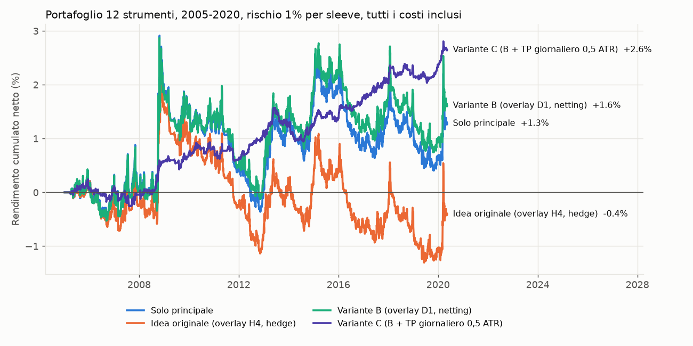
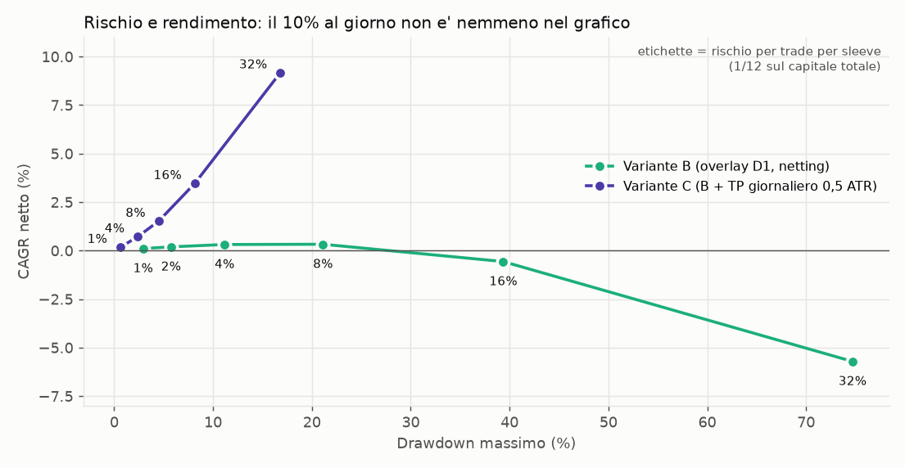
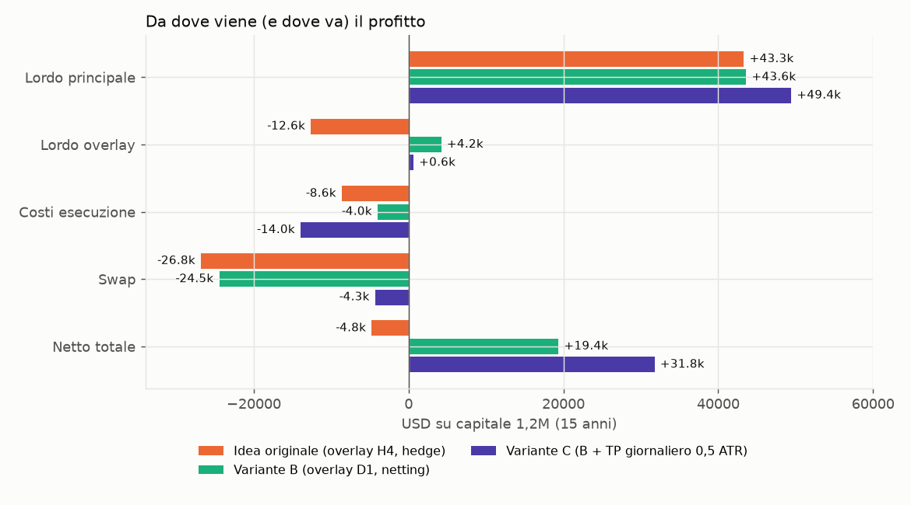
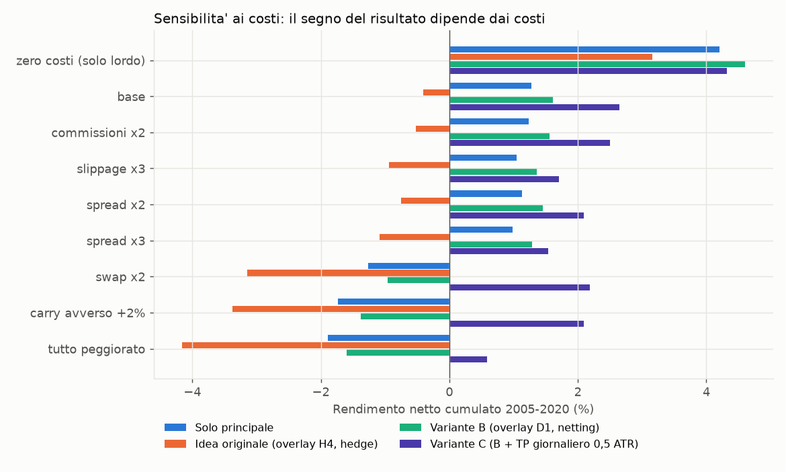

# EA "Core Trend + Counter-Trend Overlay": analisi di fattibilità, strategia e specifica

*Documento di progetto. Tutti i numeri provengono dagli script in `research/` e sono riproducibili con `research/run_all.sh`.*

## 0. Sintesi e verdetto

**Domanda:** è possibile costruire una strategia *posizione principale di lungo periodo + operazioni opposte profittevoli* con un vantaggio statistico reale dopo spread, commissioni, swap e slippage, e con rischio controllato?

**Dati usati:** 12 strumenti (6 forex, oro, 4 indici, petrolio), candele Oanda da 1 minuto dal gennaio 2005 al maggio 2020, ricampionate a H1/H4/D1. Costi di un conto ECN retail europeo: spread medio e di rollover, commissioni, slippage, swap ricostruito dai tassi storici più il markup del broker, dividendi sugli indici. Oltre 100 varianti testate, con separazione in-sample (2005-2012), validazione (2013-2016) e out-of-sample (2017-2020).

| | Risposta |
|---|---|
| **10% al giorno** | **Non raggiungibile.** Serve uno Sharpe annuo di ~7 anche usando la leva ottimale di Kelly. Il miglior sistema trovato ha Sharpe 0,6. Anche con la leva più alta testata il suo rendimento medio è dello 0,036% al giorno, circa 280 volte meno del target. Nemmeno un singolo giorno del campione ha raggiunto il 10%, neppure al livello di rischio più estremo testato (miglior giorno +7,0% con leva lorda 23×, fuori dai limiti ESMA). |
| **Idea originale** (principale D1 + hedge contro-trend H4) | **Perde dopo i costi.** Le operazioni opposte perdono già **al lordo** (−12,6k su 12×100k in 15 anni), −0,105 R per ingresso con t = −4,07: statisticamente peggiori di zero, e non migliori di ingressi casuali. Il sistema complessivo vale −0,4% contro +1,3% della sola principale. |
| **Perché** | (1) sullo stesso simbolo principale + opposta = un'unica esposizione netta: l'opposta guadagna solo se anticipa i movimenti, e contro un trend valido non ci riesce; (2) tenere a lungo la principale costa: lo swap si mangia il 56% del profitto lordo; (3) sugli orizzonti 20-60 giorni i prezzi di questo campione tendono a tornare verso la media (variance ratio < 1 su 11 strumenti su 12). |
| **Variante B** (overlay solo su scala ~20 giorni e solo contro una principale SHORT, esecuzione in netting, edge monitor) | Migliora l'originale (+1,6%, Sharpe 0,11), ma il vantaggio dell'overlay (+0,21 R, p = 0,08) **non è statisticamente significativo**. |
| **Variante C** (B + **presa di profitto giornaliera a 0,5 ATR** per strumento, rientro solo con nuovo segnale) | **L'unica struttura con un vantaggio statisticamente significativo**: +0,020 R per ingresso su 1.753 ingressi, t = 3,55, p = 0,0004. Sharpe 0,61, DD massimo 0,6% al rischio di base; positiva in tutti e tre i periodi (Sharpe 0,49 / 0,52 / 0,96), in 12 anni su 15 e con spread triplicato (Sharpe 0,36). |
| **Rendimento realistico** | Variante C a un rischio per trade dell'1,3% del capitale (limite pratico della leva ESMA): **~3,5% annuo con DD ~8%** (0,013% al giorno). Con costi da futures e Sharpe out-of-sample confermato intorno a 1, l'ordine di grandezza plausibile è **5-10% annuo con drawdown 10-15%**. |
| **Verdetto** | **La strategia originale non ha un vantaggio statistico: va riformulata.** La variante C è un'**ipotesi promettente ma non ancora validata**: è emersa dopo molti test (rischio di data-mining) e ha un profilo con tante piccole vincite e rare perdite piene. Va confermata sul 2020-2026 con i tick reali del broker (sezioni 10-11 e 14) **prima di qualsiasi uso con denaro reale**. |

Il codice MQL5 (sezione 16) implementa tutte e tre le varianti tramite input. I default corrispondono alla variante C, a rischio 0,25% per posizione, pensato per la fase di validazione.



---

## 1. Analisi della strategia

### 1.1 L'idea originale, formalizzata
- **Principale**: posizione direzionale di lungo periodo (trend-following).
- **Opposta**: quando il mercato va contro la principale, un trade in direzione contraria con logica propria (ingresso, stop, target, trailing), con due obiettivi: compensare il drawdown della principale e produrre un profitto autonomo.
- **Ciclo**: principale → movimento contrario → opposta → profitto sull'opposta → chiusura o riduzione dell'opposta → principale mantenuta.
- **Target giornaliero** con monitoraggio di capitale, costi e rendimento.

### 1.2 Problemi matematici trovati

| # | Problema | Conseguenza | Evidenza |
|---|---|---|---|
| P1 | **Identità dell'esposizione netta.** Sullo stesso simbolo, *principale L + opposta H* ≡ *una posizione L−H* (sezione 2.1). | L'opposta non è una fonte di profitto separata: è una decisione di *timing* sull'esposizione netta. Profitto dell'opposta e perdita della principale si compensano per costruzione. | `math_checks.txt` §2-3: hedge meccanico su random walk, aspettativa 0 prima dei costi, negativa dopo |
| P2 | **Conflitto di segnali.** Se il segnale di trend della principale ha un vantaggio, scommettere contro di esso sulla stessa scala ha un vantaggio negativo. | L'opposta H4 perde **al lordo**. | −0,105 R per ingresso, t = −4,07 (1.469 ingressi). Contro una principale **long**: −17,4k su 998 trade. Lo stesso segnale **nella direzione** della principale (pyramiding) fa **+17,2k lordi** |
| P3 | **Costo del mantenimento simultaneo.** L'hedge paga due swap: il differenziale dei tassi si annulla, il markup del broker si paga due volte. | 2% annuo sul nozionale coperto nel forex, 5-6% su indici, oro e petrolio con i tassi attuali | Con gli stessi segnali il netting fa risparmiare 3.160 di swap sui 12 strumenti |
| P4 | **Il 10% al giorno** richiede uno Sharpe di ~7 anche con la leva ottimale (sezione 2.3). | Forzare la leva produce rovina certa (crescita logaritmica attesa negativa) | Sezione 2.3; sezione 5.3 sui dati reali |
| P5 | **Il target giornaliero su tutto il conto** è una regola di arresto: su un processo senza memoria non crea aspettativa e dipende dalla leva usata. | Va formulato **per strumento e in unità di volatilità (ATR)**, non in % del conto | Sezione 5 |
| P6 | **La tenuta lunga è costosa** con i CFD: swap più ritorno alla media sugli orizzonti di 1-3 mesi. | Principale: lordo +43,4k, swap −24,3k, esecuzione −3,7k → netto +15,4k su 1,2M in 15 anni (Sharpe 0,085) | `exp5_final.txt` §A; profilo strumenti §7 |

### 1.3 Le tre varianti confrontate

| Variante | Principale | Opposta | Esecuzione |
|---|---|---|---|
| **A: originale** | D1, breakout 55 giorni nel regime EMA50/200, stop 4 ATR, chandelier 4 ATR | breakout H4 a 20 barre contro la principale, entrambe le direzioni, 50% per ingresso, stop 2,5 ATR H4, TP parziale 2R | hedge (ticket opposti) |
| **B: overlay robusto** | come A | breakout a **120 barre H4 (~20 giorni)**, stop 4 ATR H4, **solo contro una principale SHORT**, **edge monitor** | **netting** |
| **C: B + presa di profitto giornaliera** | come A, ma chiusa quando il movimento favorevole del giorno raggiunge **0,5 × ATR D1**; rientro solo con un nuovo segnale di breakout, non prima della chiusura D1 successiva | come B (interviene raramente) | netting |

La variante C conserva il concetto di **regime principale di lungo periodo**: la direzione è decisa dal trend D1, che dura mesi, e si opera solo in quella direzione. Cambia però il modo di stare esposti: invece di tenere la posizione per 60 giorni (pagando swap e subendo i ritorni verso la media), il profitto viene raccolto nei giorni di forte movimento e la posizione viene riaperta solo quando il trend produce un nuovo breakout. In media resta aperta 3 giorni ed è in mercato il 7,7% del tempo.

Le **operazioni opposte** sopravvivono solo nella forma B (rimbalzi nei mercati ribassisti, scala ~20 giorni). **Su questi dati non sono il motore del profitto**, e il documento non le presenta come tali.

## 2. Strategia matematica completa

### 2.1 Identità fondamentale: hedge sullo stesso simbolo = esposizione netta

Con una principale di `L` lotti long e overlay short per `H` lotti sullo **stesso simbolo**, per qualsiasi percorso di prezzo:

```
P&L(t) = L·ΔP − H·ΔP = (L − H)·ΔP
```

Quindi, finché lo strumento è lo stesso, "principale + copertura" è **matematicamente identico** a un'unica posizione di dimensione variabile `N(t) = L − H(t)`. Ne seguono tre conseguenze:

1. **Il profitto viene solo dal timing delle variazioni di `N(t)`.** L'overlay guadagna se e solo se le riduzioni di esposizione avvengono prima dei ribassi e gli aumenti prima dei rialzi. Se il segnale che decide `H(t)` non ha potere predittivo, l'aspettativa dell'overlay è **zero prima dei costi e negativa dopo** (verificato su random walk: `math_checks.txt`, sezione 3).
2. **La scomposizione "principale vs overlay" è contabile, non economica.** Con H = L l'overlay "guadagna" esattamente ciò che la principale perde: un overlay in utile non significa che la struttura sia in utile.
3. **Hedge e riduzione hanno lo stesso costo di esecuzione per round-trip** (aprire+chiudere l'hedge = chiudere+riaprire la quota), ma **l'hedge paga lo swap due volte**:
   ```
   swap_hedge = N·(s_long + s_short) = N·(−2·markup)   (il differenziale dei tassi si annulla)
   ```
   Con un markup tipico dell'1% annuo sul forex e del 2,5% su indici e oro, tenere coperto un nozionale di 100.000 per 60 giorni costa ~330 (FX) o ~820 (CFD) **senza alcun beneficio economico**.

### 2.2 Aspettativa di un trade in R, al netto dei costi

Per ogni ingresso con rischio iniziale `R` (distanza dallo stop × valore del punto × volume):

```
E[R_netto] = p·W − (1 − p)·Lo − (c_esec + c_swap) / R
    p     = probabilità di vincita, W e Lo = vincita e perdita medie in R
    c_esec = spread + commissioni + slippage (andata e ritorno)
    c_swap = |swap giornaliero| × giorni di detenzione
```

Il termine di costo pesa in proporzione inversa a `R`: stop stretti (timeframe bassi) → costi relativi alti. Nei test sui dati 2005-2020 il costo di un round-trip vale tra l'1,6% e il 4,3% dell'ATR giornaliero (sezione 12). Uno stop di 4 ATR D1 lo rende trascurabile, uno stop di 2,5 ATR H4 (~1 ATR D1) no.

### 2.3 Rendimento, rischio e il 10% giornaliero (criterio di Kelly)

Per una strategia con Sharpe giornaliero `S_d`, la massima crescita geometrica ottenibile scegliendo la leva ottimale (Kelly pieno) è:

```
g* = S_d² / 2     per giorno        (volatilità giornaliera corrispondente = S_d)
```

Per ottenere `g* = ln(1,10) = 9,53%` al giorno servono **S_d = 0,437, cioè uno Sharpe annuo di 6,9**, e anche in quel caso con una volatilità giornaliera del 44% (drawdown enormi). Riferimenti: trend-following diversificato 0,3-1,0; ottime strategie retail 1-2; market making ad alta frequenza con infrastruttura co-locata >5.

| Sharpe annuo | crescita max giornaliera (Kelly) | annua | ½ Kelly giornaliera |
|---:|---:|---:|---:|
| 0,5 | 0,05% | 13% | 0,04% |
| 1,0 | 0,20% | 65% | 0,15% |
| 2,0 | 0,80% | 639% | 0,60% |
| 3,0 | 1,80% | 8.902% | 1,35% |
| 7,1 | 10,5% | — | 7,8% |

**Forzare la leva** per avere il 10% medio aritmetico con una strategia già ottima (Sharpe 1,5) richiede una volatilità giornaliera del 106%. La crescita logaritmica attesa diventa `μ − σ²/2 = −0,46` al giorno: **probabilità di perdere oltre il 99% del capitale entro un anno = 100%** (20.000 simulazioni).

Aritmetica della capitalizzazione: +10% al giorno significa ×7,4 in un mese, ×405 in tre mesi, ×2,7·10¹⁰ in un anno (10.000 € diventerebbero 270.000 miliardi di €). Nessun mercato ha la liquidità per assorbirlo, e non esiste un track record verificabile di questo tipo.

### 2.4 Target giornaliero come regola di arresto

Per il teorema di arresto opzionale (optional stopping), chiudere tutto a un target giornaliero **non cambia l'aspettativa** di un processo senza vantaggio e **la riduce** in presenza di un drift positivo, perché taglia i giorni migliori. Aumenta invece la percentuale di giorni positivi (in simulazione: 52% → 65% con target 0,5%, mentre il rendimento medio scende da +0,056% a +0,032%). **Sui dati reali però i prezzi non sono privi di memoria**: sugli orizzonti di 1-3 mesi tendono a tornare verso la media (variance ratio < 1). Per questo la sezione 5 trova che una presa di profitto giornaliera **per strumento e in ATR** migliora il risultato. Il teorema resta valido: il vantaggio non viene dal target in sé, ma dalla memoria del processo dei prezzi.

### 2.5 Perché niente martingala

Raddoppio dopo ogni perdita con 10 livelli di capitale (1023 unità) e probabilità di perdita 0,5: rovina entro 500 cicli con probabilità del 38,6% (con p = 0,55: 71,9%) per guadagnare 500 unità. L'EA usa il principio opposto: **si aggiunge solo a un overlay già in profitto di almeno 1 R**, con esposizione overlay totale limitata al 100% della principale.

## 3. Regole precise di trading (default dell'EA = variante C)

### 3.1 Posizione principale (timeframe D1)

| Elemento | Regola |
|---|---|
| **Identificazione del trend** | Regime rialzista se EMA50 > EMA200 **e** chiusura > EMA200; ribassista se EMA50 < EMA200 **e** chiusura < EMA200; altrimenti neutro (nessun ingresso) |
| **Ingresso LONG** | regime rialzista **e** chiusura D1 > massimo delle 55 barre precedenti (breakout di Donchian nella direzione del regime) |
| **Ingresso SHORT** | simmetrico: regime ribassista e chiusura < minimo delle 55 barre precedenti |
| **Esecuzione** | alla prima occasione dopo la chiusura D1, **fuori dalla finestra di rollover** e con spread ≤ 5% dell'ATR D1; il segnale scade dopo 24 ore |
| **Dimensione** | lotti = equity × rischio% / (4 × ATR20 D1 × valore del punto), arrotondati **per difetto**; nessun trade se il lotto minimo supera il rischio |
| **Stop loss** | **sì**, sempre sul server: iniziale a 4 × ATR20 D1 |
| **Trailing** | chandelier: estremo delle chiusure dall'ingresso ∓ 4 × ATR, aggiornato a ogni chiusura D1, solo a favore |
| **Presa di profitto giornaliera (C)** | alla chiusura di ogni barra H1: se il movimento favorevole dalla chiusura D1 precedente (o dal prezzo di ingresso, se la posizione è stata aperta oggi) è ≥ **0,5 × ATR20 D1**, si chiude tutto su quel simbolo e non si valuta un nuovo ingresso prima della chiusura D1 successiva. `InpCoreDayTpAtr = 0` ripristina la tenuta lunga (A/B) |
| **Trend ancora valido** | regime invariato e prezzo sopra il chandelier (sotto, per lo short) |
| **Trend invalidato** | incrocio EMA50/EMA200 contro la posizione (uscita alla prima occasione fuori dal rollover) oppure chandelier colpito |
| **Durata media osservata** | tenuta lunga: 50-66 giorni, ~40 ingressi per strumento in 15 anni. Variante C: 2,5-4,7 giorni, ~145 ingressi per strumento; 1.725 uscite su 1.753 per presa di profitto giornaliera, 28 per stop |

**Perché lo stop è obbligatorio.** Senza stop, la perdita massima di una principale a leva è limitata solo dalla margin call. Nei dati il gap del lunedì ha raggiunto 5,6 ATR sul petrolio e 3,1 ATR su EURJPY. Lo stop a 4 ATR è abbastanza largo da non scattare con il rumore ordinario (l'uscita effettiva è il chandelier o la presa di profitto), ma fissa il rischio, e quindi la dimensione, di ogni trade. L'alternativa "niente stop, ma copertura" è stata testata: è l'hedge ingenuo, che perde più di tutte le altre varianti (sezione 4).

### 3.2 Overlay contro-trend (le operazioni opposte)

| Elemento | Regola |
|---|---|
| **Quando è ammesso** | solo se esiste una principale; **default: solo contro una principale SHORT**, cioè overlay LONG nei rimbalzi dei mercati ribassisti. Configurabile: `OV_BOTH` (idea originale), `OV_AGAINST_LONG_CORE`, `OV_DISABLED` |
| **Condizione statistica di ingresso** | chiusura H4 oltre l'estremo delle **120 barre H4 precedenti (~20 giorni)** nella direzione dell'overlay **e** EMA20/EMA50 H4 allineate (conferma di momentum). Una semplice distanza percentuale dal prezzo non basta |
| **Dimensionamento** | 50% dei lotti nominali della principale per ingresso |
| **Stop** | 4 × ATR14 H4 dal prezzo di ingresso (= 1 R) |
| **Target** | 50% chiuso a +2 R |
| **Trailing** | canale di Donchian delle ultime 60 barre H4, solo a favore |
| **Incremento** | un secondo ingresso da 50% **solo** se l'ultimo è in profitto ≥ 1 R **e** si verifica un nuovo breakout; overlay totale ≤ 100% della principale (l'esposizione netta non si inverte mai) |
| **Riduzione** | automatica al TP parziale; totale se lo stop o il trailing vengono colpiti |
| **Chiusura completa** | stop o trailing; perdita giornaliera massima; nuovo ciclo della principale; presa di profitto giornaliera (C); in netting anche all'uscita della principale |
| **Edge monitor** | se la media degli R netti **per ingresso** degli ultimi 20 overlay (reali + ombra) è ≤ 0, i nuovi overlay diventano "ombra" (tracciati senza inviare ordini) finché la media non torna positiva |
| **Esecuzione** | `EXEC_NET` (default): l'overlay riduce la posizione netta, niente doppio swap. `EXEC_HEDGE`: ticket opposti con stop/TP sul server |

## 4. Gestione dell'hedging

| Domanda | Risposta | Evidenza (12 strumenti × 100k, 2005-2020) |
|---|---|---|
| **Quando aprire la prima copertura** | Mai per una semplice distanza di prezzo. Solo su un breakout contro-trend di ~20 giorni con conferma di momentum, e (default) solo contro una principale short | Hedge "a distanza" (a 2 ATR dal picco): −27.016 da solo, −10.953 insieme alla principale. Overlay H4 originale: −20.329, contro −14.697 ± 4.588 di ingressi **casuali** con le stesse uscite, quindi peggio del caso per trade |
| **Quale percentuale coprire** | 50% per ingresso, massimo 100% | Con il 100% subito la struttura diventa piatta e paga solo costi; con il 50% la principale resta esposta al trend che la giustifica |
| **Quando aumentarla** | Solo se l'overlay è in profitto di almeno 1 R e si verifica un nuovo breakout (anti-martingala) | Aggiungere a un overlay in perdita = martingala nella direzione contraria al trend |
| **Quando NON aumentarla** | overlay in perdita o sotto 1 R; overlay già al 100%; ingressi bloccati (perdita giornaliera, stop operativo); rollover; spread eccessivo; edge monitor in modalità ombra | |
| **Quando prendere profitto** | 50% a +2 R, il resto in trailing a 60 barre H4 | |
| **Quando chiudere del tutto** | stop o trailing, nuovo ciclo della principale, perdita giornaliera massima, stop operativo | |
| **Più posizioni opposte?** | Sì, al massimo 2 ingressi (2 × 50%); in hedging ciascuno è diviso in 2 ticket (A con TP, B runner) → massimo 4 ticket overlay + 1 principale per simbolo | |
| **Esposizione massima** | overlay ≤ 100% della principale (esposizione netta tra 0 e la principale); leva lorda ≤ 5× equity su tutto il conto | |
| **Conviene tenere a lungo principale e opposta insieme?** | **No**, sullo stesso simbolo: si paga il markup dello swap due volte (2% annuo nel forex, 5-6% su indici, oro e petrolio ai tassi attuali) per un'esposizione netta che si otterrebbe semplicemente riducendo la posizione | Con gli stessi segnali il netting fa risparmiare 3.160 di swap e migliora il netto su **tutti** i 12 strumenti (da +166 a +323 ciascuno) |
| **Le opposte generano profitto autonomo?** | Solo nella forma B e in modo non significativo: +0,214 R per ingresso, t = 1,75, p = 0,08, 119 ingressi. IS +2,4k, VAL +1,2k, OOS +0,03k | Nella forma originale no: −0,105 R per ingresso, t = −4,07 |

## 5. Gestione del capitale

### 5.1 Dimensionamento
- **Rischio fisso per trade** (fixed fractional): lotti = equity × r / (distanza di stop × valore del punto). Nessun raddoppio, nessun recupero delle perdite.
- **Overlay**: frazione dei lotti nominali della principale (50% per ingresso, 100% massimo), incrementato solo in profitto.
- **Heat di portafoglio**: la somma dei rischi aperti di tutte le istanze CTO non supera `InpMaxHeatPct` (6%).
- Nota dai test: dimensionare l'overlay a **rischio costante** invece che come frazione della principale **peggiora** i risultati (overlay H4: da −20,6k a −35,7k/−70,8k; `exp6_risk_sizing.txt`). La frazione della principale è quindi mantenuta.

### 5.2 Target giornaliero: quale gestione è matematicamente più coerente

L'EA monitora e registra ogni giorno (CSV in `Common\Files` e pannello a grafico): capitale di inizio giornata, profitto lordo per ruolo, commissioni, swap, spread stimato, slippage, netto per ruolo, rendimento % giornaliero, drawdown giornaliero, esposizione lorda massima e spread medio e massimo.

Le quattro gestioni proposte sono state testate sulla variante B al 4% per sleeve (0,33% del capitale per trade), con il target calcolato sul rendimento giornaliero di ciascuna sleeve:

| Al raggiungimento del target giornaliero… | Target | Netto 15 anni | Sharpe | DD max | Giorni positivi |
|---|---:|---:|---:|---:|---:|
| nessun target | – | +4,90% | 0,10 | 11,2% | 50,1% |
| chiudere solo le posizioni speculative (overlay) e bloccare | 0,5% | +4,61% | 0,09 | 11,1% | 50,4% |
| chiudere solo gli overlay e bloccare | 1% | +4,76% | 0,10 | 11,3% | 50,1% |
| bloccare i nuovi ingressi fino al giorno dopo | 0,5% | +4,97% | 0,10 | 11,2% | 50,1% |
| **chiudere tutto e bloccare** | **0,5%** | **+10,93%** | **0,60** | **2,4%** | 37,4% |
| chiudere tutto e bloccare | 1% | +5,65% | 0,17 | 6,6% | 47,6% |
| chiudere tutto e bloccare | 2% | +2,49% | 0,07 | 8,2% | 50,4% |

Cosa si deduce:
1. **Chiudere solo gli overlay o bloccare i nuovi ingressi è neutro**, come prevede il teorema di arresto opzionale.
2. **Chiudere tutto a un target piccolo migliora molto il risultato**, contro la previsione per un processo senza memoria. Il motivo è che questi prezzi *hanno* memoria: sugli orizzonti di 20-60 giorni tendono a tornare verso la media (variance ratio 0,55-0,97 su 11 strumenti su 12). Tenere una posizione per 60 giorni restituisce parte del guadagno e paga swap per tutto il periodo; raccogliere il profitto nei giorni di forte movimento evita entrambi i costi (tempo in mercato dal 45% all'8%, swap da −98k a −19k al 4% per sleeve).
3. **Il target in % del conto è la formulazione sbagliata**: il suo significato cambia con la leva e con il numero di strumenti. La versione corretta è **per strumento e in ATR**: con rischio 4 ATR allo stop, +0,5% di sleeve corrisponde a un movimento favorevole di 0,5 ATR. Nella forma in ATR (indipendente dalla leva) la regola dà Sharpe 0,49 / 0,52 / 0,96 in IS / VAL / OOS.
4. **Non è un semplice "tenere pochi giorni"**: le uscite a tempo fisso dopo 1, 2 o 5 giorni danno Sharpe −0,18 / 0,13 / −0,12. A funzionare è l'uscita *condizionata a un giorno di forte movimento favorevole*.
5. **0,5 ATR non è stato ottimizzato finemente**: era il valore più piccolo di una griglia di tre (0,5 / 1 / 2 in termini equivalenti) fissata prima di vedere i risultati. 0,25 ATR è peggiore in validazione (Sharpe 0,09), 1 ATR è peggiore in IS (−0,19). È un'area buona, non un picco isolato, ma il campione di valori è piccolo.

**Soluzione adottata:**
- **Nessun target giornaliero sul conto** (`InpTargetMode = TGT_OFF`).
- **Presa di profitto giornaliera per strumento a 0,5 ATR** (`InpCoreDayTpAtr = 0.5`): chiude principale e overlay di quel simbolo e non valuta un nuovo ingresso prima della chiusura D1 successiva; il rientro richiede un nuovo segnale di breakout valido.
- **La principale non viene mantenuta dopo il target**: i dati mostrano che mantenerla è proprio ciò che costa.
- **Continuare "in condizioni eccezionali"**: non implementato. Non esiste una definizione verificabile di "eccezionale" e ogni eccezione aggiunge un parametro non testabile.
- **Limite di perdita giornaliera** (3%): blocca i nuovi ingressi e chiude gli overlay. È un limite di rischio, non una fonte di rendimento.

### 5.3 Rendimento a diversi livelli di rischio (e perché il 10% al giorno è fuori portata)

Portafoglio di 12 strumenti, capitale diviso in 12 sleeve. "Rischio per sleeve" = perdita allo stop in % della sleeve; sul capitale totale è 1/12 di quel valore.

**Variante B (tenuta lunga):**

| Rischio/sleeve | Rischio/capitale | Rend. medio giornaliero | CAGR | DD max | Sharpe | Peggior giorno | Leva lorda max |
|---:|---:|---:|---:|---:|---:|---:|---:|
| 1% | 0,08% | 0,0004% | 0,10% | 2,9% | 0,11 | −0,74% | 0,8 |
| 4% | 0,33% | 0,0015% | 0,31% | 11,2% | 0,10 | −2,7% | 3,3 |
| 8% | 0,67% | 0,0024% | 0,33% | 21,1% | 0,08 | −4,9% | 6,8 |
| 16% | 1,33% | 0,0019% | −0,57% | 39,4% | 0,03 | −8,0% | 14,3 |
| 32% | 2,67% | −0,008% | −5,7% | 74,7% | −0,08 | −12,4% | 28,6 |

**Variante C (presa di profitto giornaliera):**

| Rischio/sleeve | Rischio/capitale | Rend. medio giornaliero | Rend. medio mensile | CAGR | DD max | Sharpe | Peggior giorno | Leva lorda max |
|---:|---:|---:|---:|---:|---:|---:|---:|---:|
| 1% | 0,08% | 0,0007% | 0,014% | 0,17% | 0,6% | 0,61 | −0,16% | 0,7 |
| 4% | 0,33% | 0,003% | 0,06% | 0,71% | 2,4% | 0,64 | −0,64% | 2,9 |
| 8% | 0,67% | 0,006% | 0,13% | 1,51% | 4,5% | 0,68 | −1,3% | 5,8 |
| 16% | 1,33% | 0,013% | 0,29% | 3,46% | 8,1% | 0,76 | −2,5% | 11,7 |
| 32% | 2,67% | 0,036% | 0,78% | 9,16% | 16,8% | 0,86 | −7,8% | 23,0 (oltre i limiti ESMA su petrolio e indici) |



Conclusioni:
- Con la **tenuta lunga** (B) più leva non porta più rendimento: il vantaggio è così piccolo che il "volatility drag" (−σ²/2) lo annulla già oltre il 4-8% per sleeve. È la dimostrazione empirica della sezione 2.3.
- Con la **variante C** il rendimento cresce quasi linearmente con il rischio, perché il vantaggio per trade è piccolo ma molto regolare. Al livello pratico massimo (16% per sleeve, cioè 1,33% del capitale per trade, leva lorda ~12) si ottiene **~3,5% annuo, 0,013% al giorno**.
- **Rendimento realistico**, se l'out-of-sample 2020-2026 confermerà la variante C: **3-10% annuo con drawdown 5-15%**, cioè **0,01-0,04% al giorno**. Il 10% giornaliero non è compatibile con nessuna gestione del rischio ragionevole: non è stato raggiunto in nessun singolo giorno del campione, a nessun livello di rischio.
- **Il 10% "solo in certi periodi"?** No. Alla leva estrema di 32% per sleeve (oltre i limiti ESMA) i **mesi** migliori della variante C sono stati +13,3% (aprile 2011), +12,5% (febbraio 2020), +10,7% (gennaio 2018) e +10,0% (ottobre 2008), con il mese peggiore a −11,3%. Il miglior mese in 15 anni vale quanto il target di **un solo giorno**, e il miglior giorno in assoluto è stato +7,0%.

## 6. Gestione del rischio (limiti rigidi, default dell'EA)

| Limite | Default | Motivazione |
|---|---|---|
| Rischio per principale | **0,25%** dell'equity (fase di validazione) | ≈ 3% per sleeve: DD atteso ~2% (C) / ~8% (B). Salire verso 0,5-1% solo dopo aver superato i criteri della sezione 14 |
| Heat di portafoglio (tutte le istanze) | 6% | anche con correlazioni alte (2008, 2020) la perdita simultanea di tutti gli stop resta sopportabile |
| Leva lorda massima | 5× equity | al rischio 0,33% per trade la leva massima osservata è ~3× |
| Livello di margine minimo dopo un ingresso | 500% | margine di sicurezza per i gap |
| Perdita giornaliera massima | 3% → blocca gli ingressi e chiude gli overlay | la principale ha già il proprio stop; si evita di aggiungere esposizione in giornate anomale |
| **Stop operativo dell'EA** | drawdown 15% dal massimo → chiusura totale e blocco persistente, reset manuale (`InpResetHalt`) | oltre 2 volte il 95° percentile di DD simulato al rischio consigliato: se viene raggiunto, il sistema non si sta comportando come nei test |
| Posizioni per simbolo | 1 principale + 2 ingressi overlay (4 ticket in hedging) | |
| Spread massimo | 5% dell'ATR del timeframe del ruolo (+ limite assoluto opzionale) | |
| Finestra senza ingressi | rollover, default 23:00-01:00 ora server | spread 5-15 volte il normale |
| Martingala / averaging in perdita | **vietati dal codice** | sezione 2.5 |

Monte Carlo (5.000 ricampionamenti degli R per ingresso della variante B, `exp5_final.txt` §H):

| Rischio per trade (capitale) | Rendimento mediano | P(perdita) | DD mediano | DD al 95° percentile |
|---:|---:|---:|---:|---:|
| 0,08% | +5,6% | 1,3% | 1,4% | 2,4% |
| 0,33% | +24,7% | 1,4% | 5,3% | 9,5% |
| 2% | +215% | 2,6% | 29,4% | 47,3% |
| 5% | +859% | 5,4% | 60,5% | 82,1% |

(Il Monte Carlo mette in fila trade che nella realtà si sovrappongono: i rendimenti sono ottimistici. Serve per la **distribuzione dei drawdown**, che mostra come oltre il 2% per trade il DD tipico diventi insostenibile.)

## 7. Strumenti finanziari consigliati per i test

### 7.1 Criteri e profilo misurato (2005-2020)

La selezione non è casuale: ogni candidato è stato valutato su costi, volatilità, comportamento in trend e in laterale, gap e disponibilità di dati.

| Strumento | Vol. annua | ATR D1 (% prezzo) | VR 20g | VR 60g | Quota laterale* | Quota trend* | Gap lunedì medio / max (ATR) | Round-trip % ATR D1 | Hedge: swap (%/anno) | Leva ESMA |
|---|---:|---:|---:|---:|---:|---:|---:|---:|---:|---:|
| EURUSD | 9,3% | 0,83% | 0,99 | 0,96 | 62% | 3% | 0,09 / 2,5 | 1,7% | −2 | 30:1 |
| GBPUSD | 9,6% | 0,81% | 0,95 | 0,97 | 65% | 2% | 0,08 / 2,3 | 1,8% | −2 | 30:1 |
| AUDUSD | 13,0% | 1,00% | 0,90 | 0,95 | 66% | 2% | 0,09 / 1,1 | 2,0% | −2 | 20:1 |
| USDCAD | 9,3% | 0,78% | 0,89 | 0,89 | 67% | 3% | 0,08 / 2,1 | 2,3% | −2 | 30:1 |
| EURJPY | 12,0% | 0,93% | 0,89 | 0,95 | 64% | 2% | 0,11 / 3,1 | 1,6% | −2 | 30:1 |
| AUDJPY | 17,0% | 1,10% | 0,79 | 0,83 | 65% | 3% | 0,12 / 2,0 | 1,8% | −2 | 20:1 |
| XAUUSD | 18,0% | 1,45% | 0,95 | 0,73 | 62% | 4% | 0,06 / 1,0 | 2,0% | −5 | 20:1 |
| NAS100 | 21,4% | 1,45% | 0,78 | 0,73 | 58% | 6% | 0,10 / 1,5 | 2,9% | −5 | 20:1 |
| SPX500 | 19,8% | 1,17% | 0,73 | 0,64 | 62% | 5% | 0,11 / 1,8 | 3,8% | −5 | 20:1 |
| UK100 | 20,5% | 1,26% | 0,68 | 0,55 | 71% | 1% | 0,22 / 2,3 | 2,3% | −5 | 20:1 |
| JP225 | 24,7% | 1,68% | 0,79 | 0,77 | 66% | 3% | 0,26 / 2,2 | 4,3% | −5 | 20:1 |
| WTI | 38,5% | 2,83% | 1,09 | 1,40 | 58% | 4% | 0,10 / 5,6 | 3,1% | −6 | 10:1 |

\*Efficiency ratio a 60 giorni: < 0,15 = laterale, > 0,35 = trend. VR = variance ratio (> 1 persistenza, < 1 ritorno alla media).
Per tutti gli strumenti sono disponibili dati storici di buona qualità dal 2005; l'hedging è ammesso su tutti con un conto hedging MT5; il lotto minimo (0,01) richiede almeno ~10.000 di capitale per rispettare un rischio dello 0,25% su indici e oro.

### 7.2 Risultati per strumento (rischio 1% per sleeve di 100k, 2005-2020, netto di tutti i costi)

| Strumento | B: netto | B: Sharpe | C: netto | C: Sharpe | C: PF | Valutazione |
|---|---:|---:|---:|---:|---:|---|
| **XAUUSD** | +2.599 | 0,10 | **+11.733** | **1,19** | 3,90 | Il migliore in C: movimenti direzionali ampi, costi bassi rispetto all'ATR. Lo swap long (−6%/anno oggi) penalizza la tenuta lunga, non la C |
| **NAS100** | +5.885 | 0,21 | **+7.582** | 0,55 | 1,66 | Buono in entrambe; spread più alto (13,8 per trade in C) ma ATR ampio |
| **WTI** | +4.978 | 0,16 | +5.116 | 0,42 | 1,54 | Unico strumento persistente (VR60 1,40); gap estremi (5,6 ATR), leva ESMA 10:1, contratto soggetto a roll |
| **AUDUSD** | +5.106 | 0,16 | +3.958 | 0,36 | 1,35 | Il forex migliore; swap moderato |
| **JP225** | +4.891 | 0,16 | +3.110 | 0,24 | 1,29 | Buono ma spread alto (4,3% ATR) e gap del lunedì grandi (sessione asiatica) |
| **USDCAD** | +3.635 | 0,12 | +1.902 | 0,17 | 1,21 | Positivo, sensibile al petrolio |
| **AUDJPY** | +509 | 0,03 | +2.053 | 0,18 | 1,16 | Carry positivo sul long; forte ritorno alla media (VR60 0,83) |
| **SPX500** | +4.239 | 0,16 | +1.412 | 0,11 | 1,16 | Positivo; lordo/costi basso in C (1,39) |
| **EURUSD** | +2.652 | 0,10 | +359 | 0,03 | 1,05 | Costi minimi ma trend deboli; utile come riferimento di costo |
| **EURJPY** | +4.124 | 0,15 | −1.035 | −0,09 | 0,91 | Positivo in B, negativo in C |
| **GBPUSD** | −7.113 | −0,27 | −229 | −0,02 | 1,01 | Negativo in entrambe |
| **UK100** | −12.172 | −0,42 | −4.194 | −0,33 | 0,71 | Il peggiore: il più mean-reverting (VR60 0,55) e il più laterale (71%) |

### 7.3 Lista consigliata per i test in MT5

**Da testare (ordine di priorità):** XAUUSD, NAS100 (US Tech 100), WTI (USOIL), AUDUSD, JP225, USDCAD, SPX500 (US500), EURUSD (riferimento a costo minimo).

**Da includere comunque nella validazione, anche se qui sono andati male:** GBPUSD, UK100, EURJPY, AUDJPY. Escludere ora gli strumenti perdenti significherebbe scegliere il portafoglio **guardando i risultati**, cioè data-mining. In MT5 il portafoglio va scelto **solo sul periodo di ottimizzazione** e poi verificato sugli altri periodi con la stessa lista.

**Da aggiungere** (non disponibili in questo dataset): USDJPY (il cross più liquido dopo EURUSD), GER40 (DAX), XAGUSD. Motivo: diversificazione su mercati liquidi e poco costosi.

**Da evitare per la tenuta lunga:** criptovalute in CFD (swap tipicamente del 15-25% annuo sul long, gap nei fine settimana, spread alti), strumenti con leva ESMA 2:1 e azioni singole (rischio di gap sugli utili). Per la variante C le crypto potrebbero essere testate in un secondo momento, ma nessun dato qui lo supporta.

## 8. Timeframe consigliati

| Ruolo | Timeframe | Motivo |
|---|---|---|
| Regime e posizione principale | **D1** (chiusura NY 17:00, cioè server GMT+2/+3) | La persistenza dei trend (time-series momentum) è documentata in letteratura sulle scale da settimane a mesi (in questo campione più debole: variance ratio < 1); su D1 il costo di un round-trip è l'1,6-4,3% dell'ATR giornaliero, su H1 sarebbe 4-5 volte più pesante |
| Overlay | **H4** come griglia di valutazione, con canali lunghi (120 barre H4 ≈ 20 giorni) | Nei test la scala H4 "breve" (20 barre ≈ 3 giorni) perde già al lordo; la scala ~20 giorni è l'unica non negativa |
| Esecuzione | tick, ma **solo fuori rollover** | Nel rollover lo spread è 5-15 volte quello medio |
| Da testare come robustezza | principale W1/D1 con canali 40-100; overlay 60/120/180 barre H4 | Per verificare che i risultati non dipendano da una scelta puntuale |

Da **non** usare: M1-M30 per l'overlay. Con spread e commissioni retail il costo per trade supera il movimento atteso (vedi sezione 12).

## 9. Parametri da ottimizzare e parametri da NON ottimizzare

**Si possono ottimizzare su griglia grossolana (pochi valori, walk-forward):**

| Parametro | Griglia | Nota |
|---|---|---|
| `InpDonchEntry` | 40, 55, 80, 100 | superficie piatta nei test (Sharpe tra −0,02 e 0,11): è un buon segno di robustezza, non di vantaggio |
| `InpKTrail` | 3, 4, 5 | 3 è sistematicamente peggiore (esce troppo presto e moltiplica i costi) |
| `InpDonchOv` | 60, 120, 180 | 20 è da escludere (lordo negativo) |
| `InpKOvStop` | 2, 4 | |
| `InpCoreDayTpAtr` | 0 (tenuta lunga), 0,35, 0,5, 0,75 | **solo come verifica di robustezza**: se 0,35 e 0,75 non sono entrambi positivi, 0,5 è un picco casuale |
| `InpCoreRiskPct` | **non si ottimizza**: si sceglie a valle dal drawdown tollerato (sezione 5) | ottimizzarlo significa solo scegliere la leva che ha avuto più fortuna |

**Da NON ottimizzare (fissati a priori, valori standard di letteratura):**
- EMA 50/200 del regime, ATR 20/14, EMA 20/50 di conferma overlay;
- `InpAddR` = 1, `InpTpR` = 2, `InpTpFrac` = 0,5, `InpHStep` = 0,5, `InpMaxRatio` = 1;
- finestra e soglia dell'edge monitor (20 ingressi, 0 R);
- parametri di costo (spread massimo, rollover): si misurano, non si ottimizzano;
- `InpOvAgainst`: la scelta "solo contro principale short" nasce da un'ipotesi economica verificata su 3 periodi, **non** va riottimizzata per strumento (sarebbe data-mining su 5-30 trade per strumento).

Regola pratica: con ~40 trade della principale per strumento in 15 anni, ogni parametro ottimizzato in più "consuma" gradi di libertà che il campione non ha. In totale **non più di 3-4 parametri liberi**, e sempre sul portafoglio intero, mai strumento per strumento.

## 10. Metodologia di backtest (MT5)

1. **Costi reali prima di tutto**: eseguire `CTO_CostReport` e inserire nel tester commissioni reali ("Simboli personalizzati" o impostazioni del tester), spread reali (modalità tick reali), swap del broker.
2. **Modalità**: "Ogni tick basato su tick reali". Delay di esecuzione casuale attivo. Deposito realistico (almeno 10.000 USD: con meno, il lotto minimo 0,01 impedisce di rispettare il rischio su indici e oro).
3. **Periodi** (su dati del broker, idealmente 2010-2026):
   - ottimizzazione (IS): 2010-2017;
   - validazione: 2018-2021;
   - out-of-sample finale, **toccato una sola volta**: 2022-2026;
   - walk-forward: finestre di 4 anni IS e 1 anno OOS, avanzamento annuale (l'ottimizzatore MT5 supporta il "forward" singolo; per il walk-forward completo ripetere i run e concatenare gli OOS).
4. **Periodo storico minimo**: 10 anni, con almeno un mercato orso azionario (2008 o 2020 o 2022), un periodo laterale lungo (2012-2014, 2019) e un trend forte del dollaro (2014-2015, 2022).
5. **Differenze note tra backtest Python ed EA**: l'ATR di MT5 è una media semplice del true range (nel backtest Python era la media di Wilder); le barre D1 dipendono dal fuso del server (nel backtest la giornata chiude alle 22:00 UTC, come sui server GMT+2/+3). Prima di tutto confrontare in modalità visuale alcuni segnali dell'EA con quelli attesi.
6. **Separazione dei risultati**: il CSV giornaliero e il riepilogo di `OnTester` riportano principale, overlay e costi separatamente. Verificare sempre che **overlay netto > 0** anche in OOS; se è ≤ 0, impostare `InpOvAgainst = OV_DISABLED`.
7. **Metriche da registrare per ogni test**: tutte quelle della sezione 14 (profitto netto e lordo, rendimento giornaliero/mensile/annuo, % giorni positivi, PF, win rate, payoff, DD massimo e medio, recovery factor, numero e durata dei trade, esposizione media/massima, margine, commissioni, spread, swap, slippage).
8. **Portafoglio**: un'istanza per simbolo, con magic diversi nello stesso blocco da 1000 (es. 710100, 710110, 710120…), così l'heat di portafoglio è condiviso.

## 11. Metodologia di forward test

1. **Demo, almeno 6 mesi** (meglio 12), stesso broker e tipo di conto del futuro conto reale, portafoglio completo.
2. Criteri **pre-registrati** (sezione 14) scritti prima di iniziare; nessuna modifica dei parametri durante il forward (altrimenti il test riparte da zero).
3. Confronto settimanale **demo vs backtest dello stesso periodo** con gli stessi parametri: le differenze di esecuzione (spread effettivo, slippage, swap) devono stare entro il 25% di quelle stimate.
4. Poi **conto reale minimo** (lotti 0,01, rischio 0,1% per posizione) per 3-6 mesi: serve a misurare lo slippage reale, che in demo è spesso ottimistico.
5. Aumenti di rischio **solo** dopo che l'OOS cumulato (backtest OOS + forward) ha superato i criteri, e mai oltre il livello scelto nella sezione 5.
6. Numero minimo di osservazioni: per l'overlay servono ~100 ingressi per distinguere +0,2 R da 0 con t≈2. Con la frequenza osservata (~8 ingressi/anno sul portafoglio) **servono molti anni**: il forward test da solo non può validare l'overlay, può solo invalidarlo presto. Per questo l'EA ha l'edge monitor. Anche per la principale della variante C (+0,02 R per ingresso, deviazione standard ~0,24 R) servono ~550 ingressi per t ≈ 2, cioè ~5 anni sul portafoglio di 12 strumenti (~115 ingressi l'anno): la conferma deve venire dall'out-of-sample su tick reali 2020-2026, il forward test serve a verificare l'esecuzione.

## 12. Analisi dei costi

### 12.1 Ipotesi di costo per strumento (conto ECN/RAW UE; **da verificare con `CTO_CostReport`**)

| Strumento | Spread medio | Spread max (rollover/news) | Commissione per lato | Slippage per lato | Costo A+C in % ATR D1 | Swap L/S 2019 (%/anno) | Swap L/S oggi* (%/anno) | Swap di un hedge (%/anno) |
|---|---:|---:|---|---:|---:|---|---|---:|
| EURUSD | 0,2 pip | 3 pip | 3,5 USD / 100k | 0,2 pip | 1,7% | −3,6 / +1,6 | −2,7 / +0,7 | −2 |
| GBPUSD | 0,5 pip | 6 pip | 3,5 / 100k | 0,3 pip | 1,8% | −2,5 / +0,5 | −1,0 / −1,0 | −2 |
| AUDUSD | 0,4 pip | 5 pip | 3,5 / 100k | 0,2 pip | 2,0% | −2,2 / +0,2 | −1,1 / −0,9 | −2 |
| USDCAD | 0,6 pip | 6 pip | 3,5 / 100k | 0,3 pip | 2,3% | −0,5 / −1,5 | +0,5 / −2,5 | −2 |
| EURJPY | 0,6 pip | 4 pip | 3,5 / 100k | 0,1 pip | 1,6% | −1,4 / −0,7 | +0,3 / −2,2 | −2 |
| AUDJPY | 0,7 pip | 5 pip | 3,5 / 100k | 0,1 pip | 1,8% | +0,1 / −2,1 | +1,9 / −3,9 | −2 |
| XAUUSD | 0,15 $ | 1,00 $ | 2 / 100k | 0,05 $ | 2,0% | −4,7 / −0,3 | −6,2 / +1,2 | −5 |
| NAS100 | 1,2 pt | 6 pt | nello spread | 0,5 pt | 2,9% | −3,7 / −1,3 | −5,2 / +0,2 | −5 |
| SPX500 | 0,5 pt | 2,5 pt | nello spread | 0,25 pt | 3,8% | −2,7 / −2,3 | −4,2 / −0,8 | −5 |
| UK100 | 1,0 pt | 5 pt | nello spread | 0,5 pt | 2,3% | +0,5 / −5,5 | −2,5 / −2,6 | −5 |
| JP225 | 7 pt | 30 pt | nello spread | 3 pt | 4,3% | −2,9 / −2,1 | −4,5 / −0,6 | −5 |
| WTI | 0,03 $ | 0,15 $ | nello spread | 0,01 $ | 3,1% | −5,2 / −0,8 | −6,8 / +0,8 | −6 |

\*Tassi 2026 approssimati (USD 3,75%, EUR 2%, GBP 3,75%, JPY 0,75%, AUD 3,6%, CAD 2,25%); markup del broker 1% (FX) e 2,5-3% (CFD) per lato; dividendi sugli indici (SPX 2%, NAS 1%, UK 3,8%, JP 1,8%). Lo swap reale va letto dal broker (`CTO_CostReport` lo converte in % annua).

### 12.2 Costi prodotti dalla strategia (per sleeve di 100k al rischio 1%, 15 anni)

**Variante B (tenuta lunga):**

| Strumento | Trade | Spread | Commissioni | Comm./giorno | Slippage | Swap | Costo medio A+C | Lordo | Lordo/costi | Netto |
|---|---:|---:|---:|---:|---:|---:|---:|---:|---:|---:|
| EURUSD | 55 | 24 | 104 | 0,03 | 47 | −2.138 | 3,2 | 4.999 | 2,16 | 2.652 |
| GBPUSD | 60 | 54 | 107 | 0,03 | 58 | −2.071 | 3,6 | −4.823 | <0 | −7.113 |
| AUDUSD | 58 | 80 | 91 | 0,02 | 64 | −897 | 4,0 | 6.237 | 5,51 | 5.106 |
| USDCAD | 62 | 87 | 117 | 0,03 | 85 | −2.995 | 4,7 | 6.920 | 2,11 | 3.635 |
| EURJPY | 52 | 60 | 81 | 0,02 | 18 | −538 | 3,1 | 4.916 | 7,05 | 4.124 |
| AUDJPY | 55 | 114 | 75 | 0,02 | 30 | +1.562 | 4,0 | −835 | <0 | 509 |
| XAUUSD | 48 | 109 | 31 | 0,01 | 66 | −3.352 | 4,3 | 6.147 | 1,73 | 2.599 |
| NAS100 | 51 | 350 | 0 | 0 | 273 | −3.692 | 12,2 | 10.199 | 2,36 | 5.885 |
| SPX500 | 47 | 296 | 0 | 0 | 269 | −3.335 | 12,0 | 8.130 | 2,08 | 4.239 |
| UK100 | 48 | 146 | 0 | 0 | 146 | −1.679 | 6,1 | −10.242 | <0 | −12.172 |
| JP225 | 52 | 367 | 0 | 0 | 313 | −2.758 | 13,1 | 8.328 | 2,42 | 4.891 |
| WTI | 55 | 212 | 0 | 0 | 128 | −2.568 | 6,2 | 7.835 | 2,69 | 4.978 |
| **Totale** | **643** | **1.898** | **606** | | **1.496** | **−24.461** | | **47.812** | **1,68** | **19.333** |

**Variante C (presa di profitto giornaliera):**

| Strumento | Trade | Spread | Commissioni | Comm./giorno | Slippage | Swap | Costo medio A+C | Lordo | Lordo/costi | Netto |
|---|---:|---:|---:|---:|---:|---:|---:|---:|---:|---:|
| EURUSD | 147 | 77 | 342 | 0,09 | 155 | −312 | 3,9 | 1.246 | 1,40 | 359 |
| GBPUSD | 126 | 133 | 292 | 0,08 | 159 | −312 | 4,6 | 666 | 0,74 | −229 |
| AUDUSD | 145 | 200 | 267 | 0,07 | 186 | −80 | 4,5 | 4.690 | 6,40 | 3.958 |
| USDCAD | 135 | 230 | 310 | 0,08 | 230 | −338 | 5,7 | 3.009 | 2,72 | 1.902 |
| EURJPY | 128 | 171 | 263 | 0,07 | 57 | +16 | 3,8 | −560 | <0 | −1.035 |
| AUDJPY | 132 | 265 | 233 | 0,06 | 91 | +346 | 4,5 | 2.297 | 3,89 | 2.053 |
| XAUUSD | 122 | 310 | 98 | 0,03 | 207 | −426 | 5,0 | 12.773 | 12,28 | 11.733 |
| NAS100 | 195 | 1.474 | 0 | 0 | 1.224 | −1.026 | 13,8 | 11.306 | 3,04 | 7.582 |
| SPX500 | 186 | 1.302 | 0 | 0 | 1.302 | −1.008 | 14,0 | 5.023 | 1,39 | 1.412 |
| UK100 | 131 | 468 | 0 | 0 | 468 | −208 | 7,1 | −3.050 | <0 | −4.194 |
| JP225 | 161 | 1.304 | 0 | 0 | 1.117 | −518 | 15,0 | 6.049 | 2,06 | 3.110 |
| WTI | 154 | 609 | 0 | 0 | 406 | −455 | 6,6 | 6.587 | 4,48 | 5.116 |
| **Totale** | **1.762** | **6.543** | **1.805** | | **5.602** | **−4.321** | | **50.037** | **2,74** | **31.766** |

(Importi in valuta dello strumento, sleeve da 100k, rischio 1%. Scalano linearmente con il rischio. "Comm./giorno" = commissioni medie per giorno di borsa.)

### 12.3 Cosa dicono i costi



1. **Lordo e netto sono molto diversi.** Solo principale: 43,4k lordi diventano 15,4k netti (−65%). Idea originale: 30,7k lordi, −4,9k netti. Variante C: 50,0k lordi, 31,8k netti (−36%).
2. **Nella tenuta lunga il costo principale è lo swap, non lo spread**: 24,5k di swap contro 4,0k di esecuzione. La variante C inverte il rapporto (14,0k di esecuzione, 4,3k di swap) e nel complesso costa meno.
3. **L'hedge costa più del netting a parità di segnali**: +3,2k di swap (+13%).
4. **Negli indici lo spread pesa di più** (costo medio A+C 12-15 contro 3-6 nel forex): è la voce da negoziare con il broker.
5. **Con costi da futures** (niente markup sullo swap, esecuzione dimezzata) la stessa variante B passa da Sharpe 0,11 a 0,27, e la sola principale da 0,09 a 0,25. Gran parte del problema della tenuta lunga è il veicolo CFD.

## 13. Stress test

### 13.1 Sensibilità ai costi (portafoglio 12 × 100k, rischio 1%/sleeve, netto cumulato 2005-2020)

| Scenario | Solo principale | A: originale | B | **C** | C: Sharpe |
|---|---:|---:|---:|---:|---:|
| Zero costi (solo lordo) | +4,20% | +3,16% | +4,60% | +4,31% | 0,98 |
| **Base** | **+1,28%** | **−0,41%** | **+1,61%** | **+2,65%** | **0,61** |
| Commissioni ×2 | +1,24% | −0,52% | +1,56% | +2,50% | 0,58 |
| Slippage ×3 | +1,05% | −0,94% | +1,36% | +1,70% | 0,40 |
| Spread ×2 | +1,13% | −0,75% | +1,45% | +2,09% | 0,49 |
| Spread ×3 | +0,98% | −1,09% | +1,29% | +1,54% | 0,36 |
| Swap ×2 | −1,26% | −3,15% | −0,96% | +2,19% | 0,51 |
| Carry avverso +2%/anno | −1,73% | −3,37% | −1,38% | +2,09% | 0,48 |
| Tutto peggiorato (spread ×2, comm ×1,5, slippage ×3, swap ×1,5, carry +1%) | −1,89% | −4,16% | −1,60% | +0,58% | 0,14 |



- Le varianti a **tenuta lunga** (principale, A, B) diventano **negative** appena lo swap raddoppia: sono strategie di "carry pagato" con un vantaggio sottile.
- **La variante C è l'unica positiva in tutti gli scenari**, ma nello scenario peggiore conserva solo il 22% del netto: il suo punto debole sono i costi di esecuzione (spread e slippage), non lo swap.

### 13.2 Condizioni di mercato (rischio 1%/sleeve; rendimento del periodo e DD massimo)

| Periodo | Tipo | B | C |
|---|---|---|---|
| giu 2008-mar 2009 (crisi finanziaria) | forte trend ribassista, volatilità estrema | +1,46% (DD 1,42%) | +0,57% (DD 0,12%) |
| apr 2009-apr 2010 | forte trend rialzista | −0,08% (DD 0,72%) | +0,24% (DD 0,19%) |
| lug-dic 2011 (crisi dell'euro) | alta volatilità, inversioni | −0,60% (DD 0,72%) | −0,15% (DD 0,28%) |
| 2012-2013 | laterale lungo | +1,22% (DD 0,88%) | +0,67% (DD 0,35%) |
| lug 2014-mar 2015 | forte trend del dollaro | +1,20% (DD 0,46%) | +0,40% (DD 0,14%) |
| ago-set 2015 | crash lampo, gap | +0,05% (DD 0,29%) | 0,00% (DD 0,06%) |
| Q4 2018 | ribasso azionario | −0,13% (DD 0,43%) | −0,04% (DD 0,19%) |
| 2019 | laterale, bassa volatilità | −0,90% (DD 1,08%) | 0,00% (DD 0,30%) |
| feb-mag 2020 (COVID) | crash, gap, volatilità record | +0,60% (DD 1,00%) | +0,16% (DD 0,17%) |

- **Gap**: con B, 9 stop su 592 eseguiti oltre il livello (peggiore −0,82 R extra); con C, 1 su 31 (−0,06 R). Il gap massimo del lunedì è stato di 5,6 ATR (petrolio).
- **Serie negative consecutive** (per ingresso, su tutto il portafoglio): massimo 13 con B, 6 con C.
- **Per anno**: la variante C è positiva in 12 anni su 15 (negativi il 2007 con −0,13%, il 2011 con −0,20% e il 2014 con −0,04% al rischio di base). La principale B è negativa in 7 anni su 16.
- **Alta volatilità**: i periodi di crisi (2008, 2020) sono **favorevoli** a entrambe le varianti; i periodi laterali e a bassa volatilità (2019) sono i peggiori per B.

### 13.3 Robustezza dei parametri e walk-forward (principale, variante B)
- Sharpe sull'intero periodo per la griglia `InpDonchEntry` × `InpKTrail`: da −0,02 a 0,11, massimo in 55/4. La superficie è piatta e non ha picchi isolati: nessun overfitting evidente, ma nemmeno un vantaggio forte.
- Walk-forward (4 anni IS → 1 anno OOS, 2009-2020): OOS concatenato +0,16% (Sharpe 0,02) contro −0,23% con i parametri fissi. Riottimizzare **non** aggiunge valore: conviene tenere i parametri fissi di letteratura.

## 14. Criteri per stabilire se la strategia è realmente valida

Criteri **pre-registrati**: vanno applicati all'out-of-sample in MT5 (2021-2026, tick reali del broker) e poi al forward test, **senza modificare i parametri dopo averli visti**.

| # | Criterio | Soglia | B oggi | C oggi |
|---|---|---|---|---|
| 1 | Sharpe netto di portafoglio | ≥ 0,5 | 0,11 ✗ | 0,61 ✓ |
| 2 | R medio per ingresso della principale, test t | > 0 con t ≥ 2 (n ≥ 200) | +0,084, t 1,53 ✗ | +0,020, t 3,55 ✓ |
| 3 | Overlay: contributo netto e R medio | entrambi > 0 in OOS, altrimenti `OV_DISABLED` | +3,9k, t 1,75 (debole) | irrilevante (9 trade) |
| 4 | Profit factor netto | ≥ 1,15 | 1,23 ✓ | 1,26 ✓ |
| 5 | Stress: spread ×2 e swap ×2 | netto > 0 in entrambi | ✗ (swap ×2 negativo) | ✓ |
| 6 | Diffusione | ≥ 60% degli strumenti positivi e nessuno > 40% del profitto | 10/12, ✓ | 9/12; oro = 37% ✓ (al limite) |
| 7 | Stabilità di periodo | positivo in IS, VAL e OOS | ✓ (debole in IS) | ✓ |
| 8 | Parametri vicini | Sharpe dei vicini ≥ 50% del valore scelto | ✓ | da verificare (0,25 ATR peggiore in VAL) |
| 9 | Drawdown reale | ≤ 1,5 × il 95° percentile Monte Carlo al rischio scelto | da verificare | da verificare |
| 10 | Esecuzione live vs backtest | spread e slippage entro +25% delle ipotesi | da verificare | da verificare |
| 11 | Numero di test | la significatività va corretta per le >100 varianti provate (Bonferroni: p < 0,0005) | ✗ | p = 0,0004 (al limite) |

**Stato attuale:** la variante **B non è valida**. La variante **C supera i criteri misurabili su questi dati**, ma solo al limite su quelli che correggono per la ricerca stessa (11, 6, 8). Serve la conferma su dati che nessuno ha ancora guardato (2020-2026, tick del broker). Se C fallisce anche uno solo dei criteri 1, 2, 5 o 10 in quel test, va abbandonata.

## 15. Specifica tecnica completa dell'EA

### 15.1 Architettura (file in `MQL5/`)

| Modulo | File | Responsabilità |
|---|---|---|
| EA | `Experts/CTO/CoreTrendOverlay.mq5` | Input, orchestrazione degli eventi, presa di profitto giornaliera, esecuzione differita, gestione di overlay reali/virtuali/ombra, pannello, `OnTester` |
| Tipi | `Include/CTO/Defines.mqh` | Enum (`ENUM_OV_AGAINST`, `ENUM_EXEC_MODE`, `ENUM_TARGET_MODE`), struct impostazioni, struct gamba virtuale |
| Indicatori | `Include/CTO/Indicators.mqh` | EMA, ATR, canali di Donchian, regime; **solo barre chiuse** (shift ≥ 1) |
| Segnali | `Include/CTO/Signals.mqh` | `CCoreSignal` (ingresso, uscita per regime, chandelier), `COverlaySignal` (primo ingresso, incremento, stop, trailing) |
| Simbolo | `Include/CTO/SymbolMath.mqh` | Valore per unità di prezzo, nozionale, normalizzazione dei lotti **per difetto** |
| Esecuzione | `Include/CTO/Execution.mqh` | `CTrade` con filling automatico, retry su requote, filtro spread (assoluto e in % di ATR), finestra di rollover, misura dello slippage |
| Rischio | `Include/CTO/RiskManager.mqh` | Lotti a rischio fisso, heat di portafoglio (tutte le istanze CTO), leva lorda, livello di margine, perdita giornaliera, stop operativo su drawdown, target giornaliero; stato in GlobalVariables |
| Costi | `Include/CTO/CostTracker.mqh` | Contabilità separata principale/overlay: P&L eseguito, commissioni, fee, swap, spread stimato, slippage; spread medio/max; CSV giornaliero |
| Edge monitor | `Include/CTO/EdgeMonitor.mqh` | R netto **per ingresso** degli ultimi N overlay; overlay reali solo se la media è > soglia, altrimenti "ombra" |
| Registro overlay | `Include/CTO/OverlayBook.mqh` | Gambe virtuali (netting) e ombra con stop/TP software; mappa ticket→ingresso in hedging (ticket A+B); persistenza su file |
| Script costi | `Scripts/CTO/CTO_CostReport.mq5` | Misura sul broker: spread medio/mediano/p95/max e per ora, swap long/short in %/anno, costo di un hedge, giorno dello swap triplo, lotto minimo/step, leva effettiva, commissione osservata, round-trip in % di ATR |

### 15.2 Ciclo di vita a ogni tick (`OnTick`)

1. **Giornata**: al cambio di barra D1 (ora server) viene scritta la riga del CSV giornaliero (equity iniziale e finale, rendimento, DD del giorno, lordo principale/overlay, commissioni, swap, spread stimato, slippage, netto per ruolo, spread medio/max del giorno, esposizione lorda massima) e si azzerano i contatori del giorno.
2. **Rischio**: `Evaluate()` controlla stop operativo (DD dal massimo ≥ `InpHaltDDPct` → chiusura totale e blocco persistente fino a `InpResetHalt`), perdita giornaliera (blocca gli ingressi e chiude gli overlay), target giornaliero (azione da `InpTargetMode`, default nessuna).
3. **Sincronizzazione**: in netting, se la posizione netta non esiste più (stop della principale), le gambe overlay virtuali si chiudono contabilmente allo stesso prezzo; in hedging con `InpOvAfterCoreExit=false` gli overlay vengono chiusi.
4. **Gambe virtuali/ombra**: stop e TP parziale controllati a ogni tick sui prezzi bid/ask.
5. **Nuova barra H1** → presa di profitto giornaliera (variante C): se il movimento favorevole del giorno sulla barra H1 chiusa è ≥ `InpCoreDayTpAtr` × ATR D1, la chiusura di principale e overlay viene *prenotata* e la giornata è marcata (nessun nuovo ingresso valutato alla chiusura D1 successiva).
6. **Nuova barra D1** → logica principale (uscita per regime *prenotata*, aggiornamento chandelier solo a favore, nuovo segnale di ingresso *prenotato*).
7. **Nuova barra H4** → trailing Donchian di tutti gli overlay, eventuale segnale di primo ingresso o di incremento *prenotato*; stato reale/ombra deciso dall'edge monitor.
8. **Esecuzione differita**: i segnali prenotati sono eseguiti solo fuori dalla finestra di rollover, con spread accettabile, trading consentito e controlli di rischio superati; scadono dopo `InpSignalExpiryH` ore.

### 15.3 Modalità di esecuzione dell'overlay

| | `EXEC_NET` (default) | `EXEC_HEDGE` |
|---|---|---|
| Conto | netting o hedging | solo hedging (altrimenti ripiega su NET) |
| Apertura overlay | ordine opposto con magic overlay che **riduce** la posizione netta | nuovo ticket opposto; 2 ticket: A con TP parziale sul server, B runner |
| Stop/TP overlay | gestiti dall'EA (software) | sul server (sopravvivono a disconnessioni) |
| Swap | solo sull'esposizione netta | su entrambe le gambe (differenziale che si annulla + 2× markup) |
| Contabilità | P&L overlay calcolato sui prezzi della gamba virtuale e spostato da CORE a OVERLAY (il totale coincide sempre con il conto) | per magic number |
| Uscita principale | chiude anche gli overlay (la posizione netta è unica) | overlay indipendenti se `InpOvAfterCoreExit=true` |

### 15.4 Persistenza e ripartenza
- GlobalVariables (prefisso `CTO_<magic>_<simbolo>_`): giornata, equity di inizio giornata, massimo di equity, stato di blocco e di stop operativo.
- `Common\Files\CTO_ovbook_<sym>_<magic>.bin`: gambe virtuali/ombra e mappa degli ingressi in hedging.
- `Common\Files\CTO_edge_<sym>_<magic>.csv`: storico degli R per ingresso.
- `Common\Files\CTO_daily_<sym>_<magic>.csv`: report giornaliero.
- Il livello del chandelier viene ricalcolato dalle chiusure D1 dall'apertura della posizione, quindi è corretto anche dopo un riavvio.
- Nel tester la persistenza su file è disattivata (ogni test parte pulito).

### 15.5 Garanzie di progetto
- **Niente martingala**: la dimensione dipende solo da equity × rischio / distanza di stop; gli incrementi dell'overlay sono ammessi **solo se l'ultimo ingresso è in profitto di almeno `InpAddR` R** (anti-martingala) e l'overlay totale non può superare `InpMaxRatio` × principale.
- **Arrotondamento prudente**: i lotti sono sempre arrotondati per difetto; se il lotto minimo supera il rischio richiesto, il trade viene saltato.
- **Niente look-ahead**: tutte le decisioni usano barre chiuse (anche la presa di profitto giornaliera usa la chiusura H1, come nel backtest).
- **Costi sotto controllo**: filtro spread assoluto e relativo all'ATR, niente ingressi nella finestra di rollover, misura dello slippage reale.
- **Heat condiviso**: `InpMaxHeatPct` limita il rischio aperto sommato di **tutte** le istanze CTO sul conto (stesso blocco di magic number da 1000).

### 15.6 Come ottenere le tre varianti dagli input

| Variante | `InpOvAgainst` | `InpDonchOv` / `InpDonchOvExit` / `InpKOvStop` | `InpExecMode` | `InpEdgeN` | `InpCoreDayTpAtr` |
|---|---|---|---|---|---|
| A: originale | `OV_BOTH` | 20 / 10 / 2,5 | `EXEC_HEDGE` | 0 | 0 |
| B | `OV_AGAINST_SHORT_CORE` | 120 / 60 / 4 | `EXEC_NET` | 20 | 0 |
| **C (default)** | `OV_AGAINST_SHORT_CORE` | 120 / 60 / 4 | `EXEC_NET` | 20 | **0,5** |
| Solo principale | `OV_DISABLED` | – | – | – | 0 o 0,5 |

### 15.7 Criterio personalizzato per l'ottimizzatore (`OnTester`)
`recovery factor = profitto netto / drawdown di equity massimo`, moltiplicato per `min(1, sqrt(trade/100))` per penalizzare i campioni piccoli; 0 se ci sono meno di 30 trade. Serve a evitare che l'ottimizzatore scelga combinazioni con pochi trade fortunati.

### 15.8 Limiti noti del codice
- Il codice **non è stato compilato** in questo ambiente (MetaEditor non disponibile su Linux). Va compilato in MetaEditor e verificato in modalità visuale prima di qualsiasi altra cosa.
- In netting le gambe overlay usano stop software: una disconnessione lascia l'overlay senza stop sul server (resta comunque lo stop della principale sulla posizione netta).
- `OrderCalcMargin` non tiene conto della riduzione del margine per posizioni coperte: in hedging il controllo del margine è prudente.
- Le gambe ombra stimano le commissioni con l'ultima commissione per lotto osservata.
- In netting la riduzione per overlay lascia sempre almeno un lotto minimo di posizione netta (a riduzione completa MT5 chiuderebbe la posizione). Con conti molto piccoli (principale = lotto minimo) gli overlay reali quindi non si aprono.

## 16. Codice MQL5

Installazione:
1. Copiare il contenuto della cartella `MQL5/` del repository nella cartella dati del terminale (`File → Apri cartella dati`), mantenendo la struttura (`Experts/CTO`, `Include/CTO`, `Scripts/CTO`).
2. Compilare `Scripts/CTO/CTO_CostReport.mq5` ed eseguirlo **per primo**, con i nomi dei simboli del proprio broker, e confrontare `CTO_cost_report.csv` con la tabella della sezione 12.
3. Compilare `Experts/CTO/CoreTrendOverlay.mq5`.
4. Backtest secondo la sezione 10 (modalità "Ogni tick basato su tick reali").

## Appendice A: esperimenti eseguiti

| Script | Domanda | Risultato principale |
|---|---|---|
| `math_checks.py` | Il 10% al giorno è compatibile con Kelly? Hedge = esposizione netta? Il target giornaliero crea aspettativa? | Serve Sharpe ~7; identità verificata; il target non crea aspettativa su un processo senza memoria |
| `exp1_decomposition.py` | Quanto contribuiscono principale, overlay e costi? | Overlay H4 negativo già al lordo (−12,6k); hedge "a distanza" ancora peggio |
| `exp2_overlay_search.py` | Esiste un overlay con vantaggio? (72 configurazioni solo in-sample) | 19/72 positivi in IS; il migliore (scala ~20 giorni) fallisce la validazione (−7,0k) |
| `exp3_asymmetry.py` | Opposto o stesso verso? Contro long o contro short? Hedge o netting? | Stesso verso +17,2k lordi, opposto −12,9k; solo contro una principale short a ~20 giorni è positivo (+3,3k); il netting fa risparmiare 3,2k |
| `exp4_candidates.py` | Varianti per periodo | Rimbalzi contro principale short: IS +2,4k, VAL +1,2k, OOS 0 |
| `exp5_final.py` | Batteria completa (metriche, test t, ipotesi nulla, rischio, stress, regimi, target, walk-forward, Monte Carlo) | Sezioni 0-14 |
| `exp6_risk_sizing.py` | Overlay a rischio costante? | Peggiora (ipotesi respinta) |
| `exp7_futures_costs.py` | Il problema è il veicolo CFD? | Con costi da futures lo Sharpe sale da 0,11 a 0,27 |
| `exp8_daily_target_check.py` | Il "chiudi tutto al target" è un artefatto? | No: minor tempo in mercato, meno swap, lordo più alto; positivo in tutti i periodi |
| `exp9_short_hold.py` | Serve il target o basta tenere poco? | Le uscite a tempo non funzionano; il TP a 0,5 ATR sì (Sharpe 0,49 / 0,52 / 0,96) |
| `exp10_harvest.py`, `exp11_harvest_stress.py` | Variante C: rischio, strumenti, stress | Sezioni 5, 7, 13 |

## Appendice B: limiti di questa analisi
1. **Dati**: prezzi mid Oanda, 2005-2020, senza tick; spread, commissioni e slippage sono modellati, non osservati. Lo swap è ricostruito con tassi medi annui approssimati più un markup ipotetico.
2. **Granularità**: esecuzione su barre H1 con ipotesi pessimistica intrabar (se stop e target sono nella stessa barra, vince lo stop). La presa di profitto giornaliera è valutata sulla chiusura H1, quindi l'EA la replica in modo identico.
3. **Portafoglio**: 12 sleeve indipendenti, senza interazioni di margine tra loro; conversioni valutarie trascurate (P&L espresso nella valuta di quotazione).
4. **Ricerca multipla**: sono state provate oltre 100 varianti. Anche il miglior risultato (variante C, p = 0,0004) è al limite della correzione di Bonferroni. Il periodo out-of-sample 2017-2020 è stato osservato più volte durante la ricerca e quindi **non è più vergine**: da qui la richiesta di validazione sul 2020-2026.
5. **Due errori trovati e corretti durante la ricerca**, per trasparenza: (a) R-multipli calcolati per record parziale invece che per ingresso, che gonfiavano l'overlay originale fino a farlo sembrare positivo; (b) spread del forex sovrastimati di 10 volte ed esecuzione della principale durante il rollover. Tutti i numeri del documento sono successivi alle correzioni.
6. **Il codice MQL5 non è stato compilato né eseguito** in questo ambiente.
